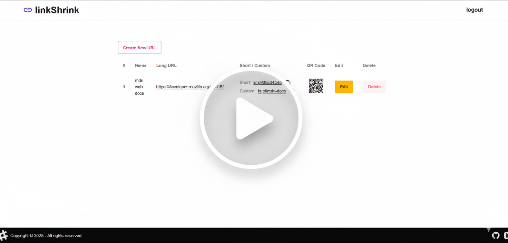

# linkShrink - URL Shortener
[](https://drive.google.com/file/d/1zr8X2ZkppLJzL7GAnM-yWg8A92UEeHAd/view?usp=sharing)

A full-stack URL shortener application built with React/TypeScript frontend and Spring Boot backend. Features JWT authentication, QR code generation, and a clean DaisyUI interface.

## Key Technologies & Techniques

### Frontend Architecture
- **React 18** with TypeScript and [Vite](https://vitejs.dev/) for fast development builds
- **[DaisyUI](https://daisyui.com/)** component library built on [Tailwind CSS](https://tailwindcss.com/)
- **[React Router](https://reactrouter.com/)** for client-side routing with nested layouts
- **[Fetch API](https://developer.mozilla.org/en-US/docs/Web/API/Fetch_API)** with credentials for authenticated requests
- **[Clipboard API](https://developer.mozilla.org/en-US/docs/Web/API/Clipboard_API)** for one-click URL copying
- **[CSS Flexbox](https://developer.mozilla.org/en-US/docs/Web/CSS/CSS_Flexible_Box_Layout)** and **[CSS Grid](https://developer.mozilla.org/en-US/docs/Web/CSS/CSS_Grid_Layout)** for responsive layouts

### Backend Stack
- **Spring Boot 3** with Spring Security for authentication
- **JWT tokens** with HttpOnly cookies for secure session management
- **JPA/Hibernate** for database operations
- **ZXing library** for QR code generation with base64 encoding
- **CORS configuration** for cross-origin requests

### Notable Implementation Details
- **[Map data structure](https://developer.mozilla.org/en-US/docs/Web/JavaScript/Reference/Global_Objects/Map)** for client-side URL management instead of arrays
- **[CSS :hover pseudo-class](https://developer.mozilla.org/en-US/docs/Web/CSS/:hover)** with opacity transitions for interactive QR codes
- **[HTML5 download attribute](https://developer.mozilla.org/en-US/docs/Web/HTML/Element/a#attr-download)** for programmatic file downloads
- **TypeScript utility types** (`Omit`, `Map<K,V>`) for type-safe data transformations

## Non-Obvious Libraries & Tools

- **[@vitejs/plugin-react](https://github.com/vitejs/vite-plugin-react)** - React Fast Refresh support in Vite
- **[ZXing (Zebra Crossing)](https://github.com/zxing/zxing)** - Java library for QR code generation
- **[Spring Security](https://spring.io/projects/spring-security)** - Authentication and authorization framework
- **[Tailwind CSS v4](https://tailwindcss.com/blog/tailwindcss-v4-alpha)** - Latest alpha version with simplified configuration
- **[TypeScript Project References](https://www.typescriptlang.org/docs/handbook/project-references.html)** - Split TypeScript compilation for app and build tools

## Project Structure

```
├── frontend/
│   ├── src/
│   │   ├── components/
│   │   ├── services/
│   │   └── utils/
│   ├── index.html
│   ├── package.json
│   ├── tailwind.config.ts
│   └── vite.config.ts
└── backend/
    ├── src/
    │   ├── main/
    │   │   ├── java/com/youngineer/backend/
    │   │   │   ├── authentication/
    │   │   │   ├── controller/
    │   │   │   ├── dto/
    │   │   │   ├── models/
    │   │   │   ├── repository/
    │   │   │   ├── services/
    │   │   │   └── utils/
    │   │   └── resources/
    │   └── test/
    ├── pom.xml
    └── create.sql
```

- **[`frontend/`](frontend/)** - React TypeScript application with Vite build system
- **[`backend/`](backend/)** - Spring Boot REST API with JWT authentication
- **[`frontend/src/components/`](frontend/src/components/)** - React components including authentication, URL management, and UI components
- **[`frontend/src/services/`](frontend/src/services/)** - API service layer with authentication and URL management functions
- **[`backend/src/main/java/.../authentication/`](backend/src/main/java/com/youngineer/backend/authentication/)** - JWT filters, security configuration, and CORS setup
- **[`backend/src/main/java/.../dto/`](backend/src/main/java/com/youngineer/backend/dto/)** - Data transfer objects for API requests and responses

## Features

- User authentication with JWT tokens
- URL shortening with custom aliases
- QR code generation for shortened URLs
- Copy-to-clipboard functionality
- Responsive design with DaisyUI components
- Secure API with CORS configuration